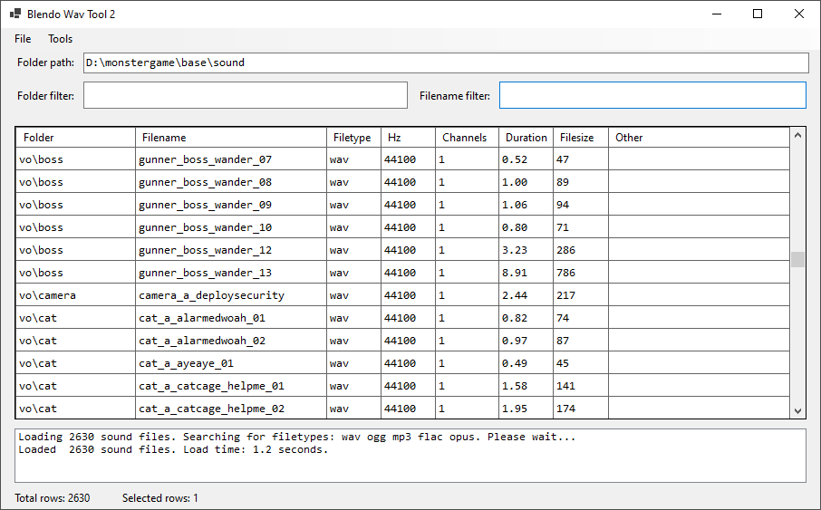

# Blendo Wav Tool
 

## About
Blendo Wav Tool is a tool for managing/browsing audio assets. This is intended for work that involves sorting through a large amount of audio files, such as a video game project.

A version of this tool was used during the development of the game [Skin Deep](https://blendogames.com/skindeep).

Functionality includes:
- rapid & intuitive asset search functionality.
- one-click interface to play/edit assets.
- can display max amplitudes.
- can display silences at start/end of assets.
- can find duplicate assets.

## Download
If you want to download and use this tool, it's [available here](https://blendogames.itch.io/blendo-wav-tool).

## License
This source code is licensed under the MIT license.

## Credits
- by [Brendon Chung](https://blendogames.com)

## Libraries used
- [TagLibSharp](https://github.com/mono/taglib-sharp)
- [NAudio](https://github.com/naudio/NAudio)
